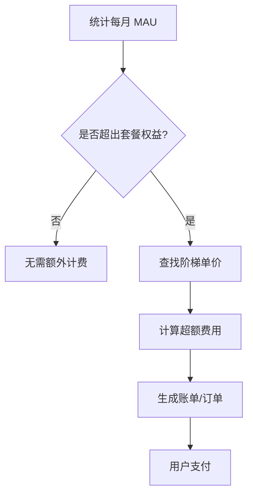

# Authing 模型设计（详细字段说明）

---

## 1. 用户池相关

### 1.1 用户池（UserPool）

**作用**：顶层隔离单元，决定数据的物理/逻辑隔离。

| 字段名      | 类型      | 说明                       |
|-------------|-----------|----------------------------|
| id          | String    | 用户池唯一标识             |
| name        | String    | 用户池名称                 |
| logo        | String    | 用户池 Logo（图片 URL）    |
| description | String    | 用户池描述                 |
| type        | String    | 类型（B2C/B2B/B2E）        |
| status      | Int       | 状态（启用、禁用等）       |
| isDeleted   | Boolean   | 是否已删除                 |
| config      | JSON      | 认证策略、注册方式等配置   |
| createdAt   | DateTime  | 创建时间                   |
| updatedAt   | DateTime  | 更新时间                   |

[用户池概念](https://docs.authing.cn/v2/concepts/user-pool.html)

#### 用户池类型区别（B2C / B2B / B2E）

| 类型   | 全称                  | 主要面向对象         | 组织结构         | 认证方式                  | 权限管理         | 多租户/租户模型 | 典型场景                  |
|--------|-----------------------|----------------------|------------------|---------------------------|------------------|------------------|---------------------------|
| B2C    | Business to Consumer  | 终端消费者（C端用户）| 无或简单分组     | 邮箱/手机/社交登录        | 简单             | 通常无           | 电商、App、在线教育等     |
| B2B    | Business to Business  | 企业客户（企业用户） | 企业/组织/部门   | 邮箱/手机/社交/企业身份源 | 复杂（RBAC/ABAC）| 必须             | SaaS平台、企业服务        |
| B2E    | Business to Employee  | 企业员工             | 企业/部门/岗位   | 企业身份源/内部认证       | 复杂（RBAC/ABAC）| 可选             | OA、ERP、HR、员工门户等   |

**详细说明：**
- **B2C**：面向终端消费者，注重体验，认证方式多样，组织结构简单，权限管理粗粒度。
- **B2B**：面向企业客户，组织结构复杂，权限管理细粒度，必须支持多租户和企业身份源。
- **B2E**：面向企业员工，组织结构复杂，权限管理细粒度，支持企业身份源和多租户（可选）。

---

## 2. 费用管理模块

### 2.1 套餐（Package/Plan）

**作用**：定义计费计划、功能包、服务等级等。控制用户池可用的功能范围、额度、API 调用次数等。

| 字段名      | 类型      | 说明                                 |
|-------------|-----------|--------------------------------------|
| id          | String    | 套餐唯一标识                         |
| code        | String    | 套餐编码（如 free/basic/pro/ent）     |
| name        | String    | 套餐名称（如"免费版"、"基础版"）     |
| description | String    | 套餐描述                             |
| group       | String    | 套餐分组（如"标准/定制"）             |
| sceneCode   | String    | 适用场景编码（如 B2C/B2B）            |
| unitPrice   | Decimal   | 单价（如每 MAU 单价）                 |
| mau         | Int       | MAU 数量（Monthly Active Users）      |
| status      | Int       | 状态（启用、禁用等）                  |
| createdAt   | DateTime  | 创建时间                             |
| updatedAt   | DateTime  | 更新时间                             |

**参考文档**：
- [计费与套餐说明](https://docs.authing.cn/v2/guides/billing/)
- [功能授权与额度](https://docs.authing.cn/v2/guides/billing/feature.html)

---

### 2.2 权益项（RightItem/Feature）

**作用**：具体描述套餐下的某一项功能、额度或服务。

| 字段名      | 类型      | 说明                                 |
|-------------|-----------|--------------------------------------|
| id          | String    | 权益项唯一标识                       |
| packageId   | String    | 所属套餐                             |
| name        | String    | 权益项名称（如"最大用户数"）         |
| description | String    | 权益项描述                           |
| type        | String    | 权益类型（功能/额度/服务）           |
| value       | String    | 权益值（如 10000/true）              |
| unit        | String    | 单位（如次、GB、天、个等）           |
| createdAt   | DateTime  | 创建时间                             |
| updatedAt   | DateTime  | 更新时间                             |

**参考文档**：
- [功能授权与额度](https://docs.authing.cn/v2/guides/billing/feature.html)
- [计费 FAQ](https://docs.authing.cn/v2/guides/billing/faq.html)

---

### 2.3 用户池套餐绑定（UserPoolPackage）

| 字段名      | 类型      | 说明                                 |
|-------------|-----------|--------------------------------------|
| id          | String    | 主键                                 |
| userPoolId  | String    | 用户池唯一标识                       |
| packageId   | String    | 绑定的套餐                           |
| startTime   | DateTime  | 套餐生效时间                         |
| endTime     | DateTime  | 套餐到期时间                         |
| status      | Int       | 状态（生效/过期/待生效）             |
| createdAt   | DateTime  | 创建时间                             |
| updatedAt   | DateTime  | 更新时间                             |

---

### 2.4 用量（Usage）

| 字段名      | 类型      | 说明                                 |
|-------------|-----------|--------------------------------------|
| id          | String    | 主键                                 |
| userPoolId  | String    | 用户池唯一标识                       |
| rightItemId | String    | 权益项唯一标识                       |
| value       | String    | 实际用量                             |
| period      | String    | 统计周期（月/年）                    |
| createdAt   | DateTime  | 创建时间                             |

---

### 2.5 订单（Order）

| 字段名      | 类型      | 说明                                 |
|-------------|-----------|--------------------------------------|
| id          | String    | 订单唯一标识                         |
| userPoolId  | String    | 用户池唯一标识                       |
| packageId   | String    | 购买的套餐                           |
| amount      | Decimal   | 金额                                 |
| payMethod   | String    | 支付方式（如支付宝、微信、对公转账） |
| status      | Int       | 状态（已支付/未支付/已取消）         |
| createdAt   | DateTime  | 创建时间                             |
| updatedAt   | DateTime  | 更新时间                             |

---

### 2.6 MAU 阶梯计费（分级定价）

**背景**：部分套餐（如 Authing）对"外部活跃用户（MAU）"采用分级定价，套餐包含基础 MAU 权益，超出后按阶梯单价计费，不同套餐阶梯单价不同。

#### 2.6.1 MAU 阶梯定价表（MauPricingTier）

| 字段名         | 类型      | 说明                       |
|----------------|-----------|----------------------------|
| id             | String    | 主键                       |
| packageId      | String    | 套餐ID                     |
| minMau         | Int       | 起始 MAU 数                |
| maxMau         | Int       | 结束 MAU 数                |
| pricePerMau    | Decimal   | 单价（元/个）              |
| createdAt      | DateTime  | 创建时间                   |
| updatedAt      | DateTime  | 更新时间                   |

**示例数据：**

| packageId | minMau | maxMau | pricePerMau |
|-----------|--------|--------|-------------|
| 1 (免费)  | 1001   | 5000   | 0.1         |
| 2 (基础)  | 10001  | 50000  | 0.08        |
| 3 (高级)  | 100001 | 500000 | 0.05        |

#### 2.6.2 业务流程

1. 每月统计每个用户池的 MAU（Monthly Active User）。
2. 查询当前套餐的 MAU 权益（如 10000）。
3. 若实际 MAU > 权益数，进入超额计费：
   - 查找对应套餐的 MAU 阶梯定价表，找到实际 MAU 所在区间。
   - 计算超额费用：
     超额费用 = (实际 MAU - 权益 MAU) × 单价
4. 生成账单/订单，记录本月超额 MAU 费用，用户可支付。

#### 2.6.3 账单/订单表扩展

| 字段         | 类型      | 说明           |
|--------------|-----------|----------------|
| id           | String    | 主键           |
| userPoolId   | String    | 用户池ID       |
| type         | String    | 类型（如 MAU 超额）|
| amount       | Decimal   | 金额           |
| mauCount     | Int       | 超额 MAU 数    |
| month        | String    | 账单月份       |
| status       | Int       | 状态           |
| createdAt    | DateTime  | 创建时间       |

#### 2.6.4 业务流程图

#### 2.6.5 关键说明
- 不同套餐的阶梯单价不同，需按套餐区分。
- 权益项和阶梯定价都应支持后台动态配置，便于后续调整。
- 账单生成与支付可自动化，也可人工触发。

---

## 3. 用户相关

（以下内容保持原有结构，略）
