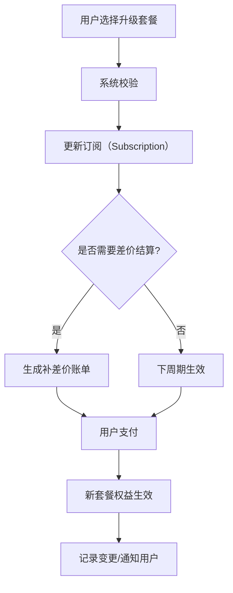

# Stripe Billing 计费模型表结构设计

---

## Stripe 计费模型说明

Stripe Billing 是全球领先的 SaaS 计费系统之一，广泛应用于订阅、用量计费、一次性付费等多种场景。其核心理念是“产品-价格-订阅-账单-支付”解耦，支持灵活的定价、用量、优惠、账单和支付流程。

### Stripe 计费模型核心要素

- **Product（产品）**：你售卖的服务或商品，仅定义“是什么”，不涉及价格。
- **Price（价格）**：某个产品的具体定价方式，支持固定、阶梯、用量、一次性等多种类型。
- **Customer（客户）**：终端用户或企业客户。
- **Subscription（订阅）**：客户对某个产品价格的订阅关系，支持周期、状态、试用、自动续费等。
- **Subscription Item（订阅项）**：一个订阅下可有多个产品/价格组合。
- **Invoice（账单）**：每个订阅周期自动生成账单，包含所有应付项目、用量明细、折扣、税费等。
- **Payment（支付）**：账单可通过多种方式支付，支持自动扣款、失败重试、手动支付。
- **Usage Record（用量记录）**：用于用量型计费，定期上报用量，Stripe 自动结算。
- **Coupon/Promotion（优惠券/促销码）**：灵活的折扣、促销、免费试用等。

### 业务流程简述
1. 创建产品和价格（如标准版SaaS、月付/年付/用量阶梯价等）
2. 客户下单，创建订阅，选择价格
3. Stripe 自动生成账单，客户支付
4. 用量型计费可定期上报用量，自动结算超额费用
5. 支持升级/降级/取消/试用/优惠等多种场景

---

## 1. 产品表（product）

```sql
CREATE TABLE product (
    id              VARCHAR(64) PRIMARY KEY,
    name            VARCHAR(128) NOT NULL,
    description     VARCHAR(255),
    status          VARCHAR(32) DEFAULT 'active', -- active/inactive
    created_at      DATETIME NOT NULL,
    updated_at      DATETIME NOT NULL
);
```

---

## 2. 价格表（price）

```sql
CREATE TABLE price (
    id              VARCHAR(64) PRIMARY KEY,
    product_id      VARCHAR(64) NOT NULL,
    type            VARCHAR(32) NOT NULL, -- recurring/one_time/usage
    amount          DECIMAL(18,2),        -- 固定价格
    currency        VARCHAR(16) DEFAULT 'CNY',
    interval        VARCHAR(16),          -- month/year/once
    usage_type      VARCHAR(32),          -- metered/licensed
    tier_mode       VARCHAR(32),          -- graduated/volume/null
    status          VARCHAR(32) DEFAULT 'active',
    created_at      DATETIME NOT NULL,
    updated_at      DATETIME NOT NULL,
    FOREIGN KEY (product_id) REFERENCES product(id)
);
```

---

## 3. 阶梯定价表（price_tier）

```sql
CREATE TABLE price_tier (
    id              BIGINT PRIMARY KEY AUTO_INCREMENT,
    price_id        VARCHAR(64) NOT NULL,
    up_to           INT,                 -- 阶梯上限（null表示无上限）
    unit_amount     DECIMAL(18,4) NOT NULL, -- 单价
    FOREIGN KEY (price_id) REFERENCES price(id)
);
```

---

## 4. 客户表（customer）

```sql
CREATE TABLE customer (
    id              VARCHAR(64) PRIMARY KEY,
    name            VARCHAR(128) NOT NULL,
    email           VARCHAR(128),
    status          VARCHAR(32) DEFAULT 'active',
    created_at      DATETIME NOT NULL,
    updated_at      DATETIME NOT NULL
);
```

---

## 5. 订阅表（subscription）

```sql
CREATE TABLE subscription (
    id              VARCHAR(64) PRIMARY KEY,
    customer_id     VARCHAR(64) NOT NULL,
    status          VARCHAR(32) NOT NULL, -- active/canceled/trialing/paused
    start_date      DATETIME NOT NULL,
    end_date        DATETIME,
    cancel_at       DATETIME,
    trial_end       DATETIME,
    auto_renew      BOOLEAN DEFAULT TRUE,
    created_at      DATETIME NOT NULL,
    updated_at      DATETIME NOT NULL,
    FOREIGN KEY (customer_id) REFERENCES customer(id)
);
```

---

## 6. 订阅项表（subscription_item）

```sql
CREATE TABLE subscription_item (
    id              VARCHAR(64) PRIMARY KEY,
    subscription_id VARCHAR(64) NOT NULL,
    price_id        VARCHAR(64) NOT NULL,
    quantity        INT DEFAULT 1,
    created_at      DATETIME NOT NULL,
    updated_at      DATETIME NOT NULL,
    FOREIGN KEY (subscription_id) REFERENCES subscription(id),
    FOREIGN KEY (price_id) REFERENCES price(id)
);
```

---

## 7. 用量记录表（usage_record）

```sql
CREATE TABLE usage_record (
    id                  BIGINT PRIMARY KEY AUTO_INCREMENT,
    subscription_item_id VARCHAR(64) NOT NULL,
    quantity            INT NOT NULL,
    timestamp           DATETIME NOT NULL,
    period              VARCHAR(16), -- 例如 '2024-06'
    created_at          DATETIME NOT NULL,
    FOREIGN KEY (subscription_item_id) REFERENCES subscription_item(id)
);
```

---

## 8. 账单表（invoice）

```sql
CREATE TABLE invoice (
    id              VARCHAR(64) PRIMARY KEY,
    customer_id     VARCHAR(64) NOT NULL,
    subscription_id VARCHAR(64),
    amount_due      DECIMAL(18,2) NOT NULL,
    currency        VARCHAR(16) DEFAULT 'CNY',
    status          VARCHAR(32) NOT NULL, -- open/paid/void/failed
    due_date        DATETIME,
    paid_at         DATETIME,
    created_at      DATETIME NOT NULL,
    updated_at      DATETIME NOT NULL,
    FOREIGN KEY (customer_id) REFERENCES customer(id),
    FOREIGN KEY (subscription_id) REFERENCES subscription(id)
);
```

---

## 9. 支付表（payment）

```sql
CREATE TABLE payment (
    id              VARCHAR(64) PRIMARY KEY,
    invoice_id      VARCHAR(64) NOT NULL,
    amount          DECIMAL(18,2) NOT NULL,
    currency        VARCHAR(16) DEFAULT 'CNY',
    method          VARCHAR(32), -- alipay/wechat/card/bank
    status          VARCHAR(32) NOT NULL, -- succeeded/failed/pending
    paid_at         DATETIME,
    created_at      DATETIME NOT NULL,
    FOREIGN KEY (invoice_id) REFERENCES invoice(id)
);
```

---

## 10. 优惠券/促销码表（coupon）

```sql
CREATE TABLE coupon (
    id              VARCHAR(64) PRIMARY KEY,
    code            VARCHAR(64) NOT NULL,
    discount_type   VARCHAR(32), -- percent/fixed
    discount_value  DECIMAL(18,2),
    status          VARCHAR(32) DEFAULT 'active',
    valid_from      DATETIME,
    valid_to        DATETIME,
    created_at      DATETIME NOT NULL
);
```

---

## 初始化 SQL 示例

以“标准版SaaS产品，月付99元，阶梯用量计费”为例，插入部分核心数据：

```sql
-- 1. 产品
INSERT INTO product (id, name, description, status, created_at, updated_at)
VALUES ('prod_std', '标准版SaaS', '标准功能套餐', 'active', NOW(), NOW());

-- 2. 价格（包月固定价）
INSERT INTO price (id, product_id, type, amount, currency, interval, usage_type, tier_mode, status, created_at, updated_at)
VALUES ('price_monthly', 'prod_std', 'recurring', 99.00, 'CNY', 'month', NULL, NULL, 'active', NOW(), NOW());

-- 3. 价格（用量阶梯价）
INSERT INTO price (id, product_id, type, amount, currency, interval, usage_type, tier_mode, status, created_at, updated_at)
VALUES ('price_usage', 'prod_std', 'usage', NULL, 'CNY', NULL, 'metered', 'graduated', 'active', NOW(), NOW());

-- 4. 阶梯定价
INSERT INTO price_tier (price_id, up_to, unit_amount)
VALUES 
  ('price_usage', 1000, 0.00),         -- 前1000免费
  ('price_usage', 5000, 0.10),         -- 1001-5000，每个0.10元
  ('price_usage', NULL, 0.08);         -- 5001及以上，每个0.08元

-- 5. 客户
INSERT INTO customer (id, name, email, status, created_at, updated_at)
VALUES ('cus_001', 'Acme 公司', 'admin@acme.com', 'active', NOW(), NOW());

-- 6. 订阅（包月订阅）
INSERT INTO subscription (id, customer_id, status, start_date, end_date, auto_renew, created_at, updated_at)
VALUES ('sub_001', 'cus_001', 'active', NOW(), NULL, TRUE, NOW(), NOW());

-- 7. 订阅项（包月+用量）
INSERT INTO subscription_item (id, subscription_id, price_id, quantity, created_at, updated_at)
VALUES 
  ('subitem_001', 'sub_001', 'price_monthly', 1, NOW(), NOW()),
  ('subitem_002', 'sub_001', 'price_usage', 1, NOW(), NOW());
```

---

## 典型计费过程举例

**场景：客户 Acme 公司 6 月份使用标准版SaaS，月付99元，API用量3500次。**

### 步骤

1. **订阅生效**  
   - Acme 公司订阅“标准版SaaS”，选择包月+用量计费。
   - 系统创建 subscription、subscription_item 记录。

2. **账单周期到来（如7月1日结算6月）**  
   - Stripe 自动生成 invoice（账单）。

3. **用量上报**  
   - 6月累计 API 用量3500次，系统写入 usage_record。

4. **用量计费计算**  
   - 前1000免费，1001-3500共2500次，每次0.10元，共250元。
   - 总费用 = 99元（包月）+ 250元（用量）= 349元。

5. **账单明细**
   - invoice.amount_due = 349.00
   - invoice.status = 'open'

6. **客户支付**
   - 客户通过 Stripe 支付，payment.status = 'succeeded'
   - invoice.status = 'paid'

### 账单明细示例

| 项目         | 数量   | 单价   | 小计   |
|--------------|--------|--------|--------|
| 包月订阅     | 1      | 99.00  | 99.00  |
| API用量      | 2500   | 0.10   | 250.00 |
| **合计**     |        |        | 349.00 |


---

## 用户升级套餐的标准流程

当用户升级套餐时，标准流程如下，兼顾了业务体验、账单结算和数据一致性：

### 1. 用户发起升级
- 用户在前端界面选择目标套餐（如“高级版”）。
- 选择升级周期（如月/年）。

### 2. 系统校验与准备
- 校验当前订阅状态（active/trialing）。
- 校验目标套餐可用性和价格。

### 3. 创建/更新订阅（Subscription）
- 推荐直接更新原有订阅（subscription），而不是新建。
- 通过 Stripe API 更新 subscription 的 price/plan 信息。
- 可选择立即生效（prorate，按比例结算差价）或下周期生效。

### 4. 差价结算（Proration）
- Stripe 默认会自动计算本周期剩余时间的差价（prorated invoice）。
- 例如：月初升级，系统会退还未用完的基础版费用，并收取升级后剩余天数的高级版费用。
- 差价会体现在下一个 invoice（账单）中，或立即生成一张补差价账单。

### 5. 账单生成与支付
- Stripe 自动生成 invoice，包含升级差价、下周期新套餐费用等。
- 用户支付账单，订阅状态变为 active。

### 6. 权益即时生效
- 升级后，新的套餐权益（如更高额度、更多功能）立即生效。
- 系统同步更新用户的权限、额度等。

### 7. 记录变更与通知
- 记录订阅变更历史，便于审计和售后。
- 通知用户升级成功、权益变更、账单明细等。

#### 业务流程图



